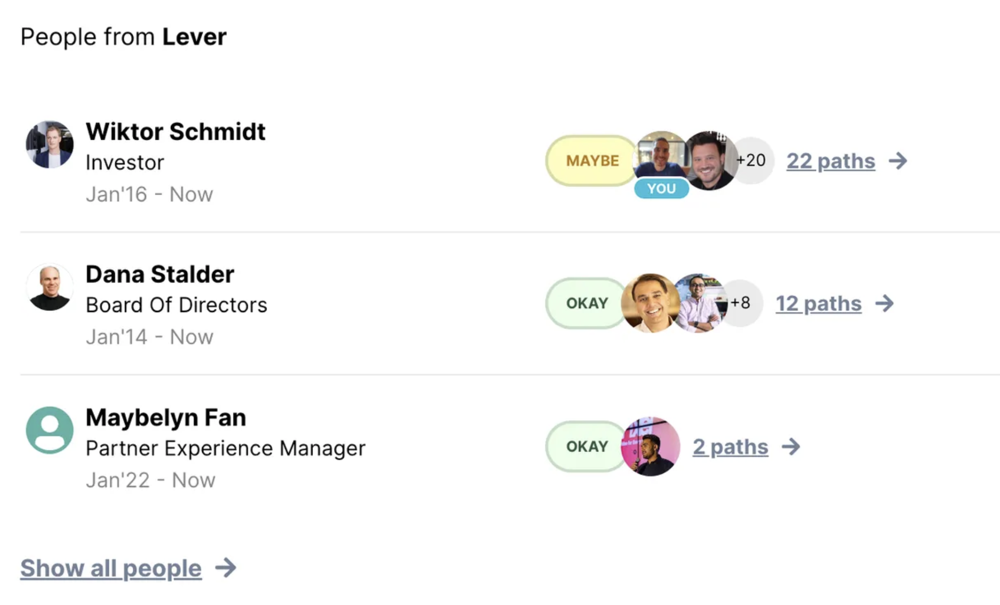

<Info>**Coming soon**: this feature is not yet available</Info>

<Accordion title="Example" defaultOpen="false">
  
</Accordion>

<Steps>
  <Step title="Pre-requisites" titleSize="h2">
    🛠️ **Initiate the JS SDK**

    Copy the snippet below and add it within the `<head>` tag The unique user identifier should be unique - such as an email, or an internal ID. This is required for you to later on be able to cancel users from being added to your upcoming bill.

    To explore the product without syncing a real account, you can use the `demo_pk_global` key. This reduces onboarding friction and allows you to evaluate key features faster. When ready for production, replace it with your real `VILLAGE_PUBLIC_KEY`.

    ```javascript
    <script>
     (function(){var w=window;var d=document;var v=w.Village||{};d.head.appendChild(Object.assign(d.createElement("style"),{textContent:'[village-paths-availability="found"],[village-paths-availability="not-found"]{display:none}'}));v.q=v.q||[];v._call=function(method,args){v.q.push([method,args])};v.init=function(){v._call("init",arguments)};v.identify=function(){v._call("identify",arguments)};w.Village=v;var l=function(){var s=d.createElement("script");s.type="text/javascript";s.async=true;s.src="https://js.village.do";var x=d.getElementsByTagName("script")[0];x.parentNode.insertBefore(s,x)};if(w.Village.loaded)return;if(w.attachEvent){w.attachEvent("onload",l)}else{w.addEventListener("load",l,false)}w.Village.loaded=true})();
      Village.init('VILLAGE_PUBLIC_KEY');
      Village.identify('YOUR_UNIQUE_USER_IDENTIFIER'); // Less secure

      // To explore the product without syncing a real account, you may use the demo key:
      // Village.init('demo_pk_global');

      // Village.authorize('USER_TOKEN'); Coming soon
    </script>
    ```

  </Step>
  <Step title="Embed the Paths Experience" titleSize="h2">
    Village embeds a paths experience to any person or company, so you don’t have to rebuild that experience.

    Add `village-module="paths"` module attribute to any html element and pass the target person/company URL `village-data-url`.

    ```markup
    <!-- URL could be a person's linkedin URL, a company URL, or a LinkedIn company page -->
    <div village-module="paths" village-data-url="https://www.linkedin.com/company/google">
      <div village-paths-availability="found">
        <!-- Village will auto-populate this with an iframe if paths were found -->
      </div>
      <div village-paths-availability="not-found">
        <!-- You can ask the user to grow their network using the sync module -->
        No paths found. <a href="#" village-module="sync">Grow my network →</a>
      </div>
      <div village-paths-availability="loading"><!-- add your loading icon here --></div>
    </div>
    ```

  </Step>
</Steps>
