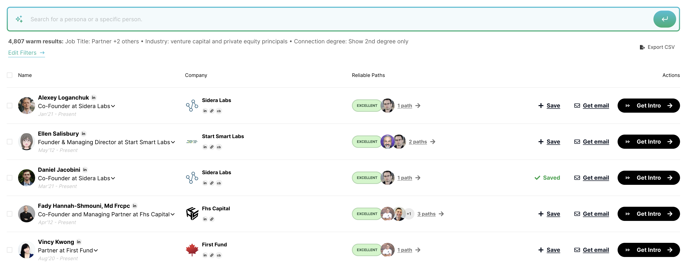

<Accordion title="Example" defaultOpen="true">
  

  <Note>
    Brand colors and CTA callback follow your global app settings
  </Note>
</Accordion>

<Steps>
  <Step title="Pre-requisites" titleSize="h2">
    **Initiate the JS SDK**

    Copy the snippet below and add it within the `<head>` tag The unique user identifier should be unique - such as an email, or an internal ID. This is required for you to later on be able to cancel users from being added to your upcoming bill.

    To explore the product without syncing a real account, you can use the `demo_pk_global` key. This reduces onboarding friction and allows you to evaluate key features faster. When ready for production, replace it with your real `VILLAGE_PUBLIC_KEY`.

    ```javascript
    <script>
     (function(){var w=window;var d=document;var v=w.Village||{};d.head.appendChild(Object.assign(d.createElement("style"),{textContent:'[village-paths-availability="found"],[village-paths-availability="not-found"]{display:none}'}));v.q=v.q||[];v._call=function(method,args){v.q.push([method,args])};v.init=function(){v._call("init",arguments)};v.identify=function(){v._call("identify",arguments)};w.Village=v;var l=function(){var s=d.createElement("script");s.type="text/javascript";s.async=true;s.src="https://js.village.do";var x=d.getElementsByTagName("script")[0];x.parentNode.insertBefore(s,x)};if(w.Village.loaded)return;if(w.attachEvent){w.attachEvent("onload",l)}else{w.addEventListener("load",l,false)}w.Village.loaded=true})();
    	Village.init('VILLAGE_PUBLIC_KEY');
    	Village.identify('YOUR_UNIQUE_USER_IDENTIFIER'); // Less secure
    	Village.authorize('USER_TOKEN'); // More secure

        // To explore the product without syncing a real account, you may use the demo key:
        // Village.init('demo_pk_global');
    </script>
    ```
  </Step>
  <Step title="Embed the search module" titleSize="h2">
    Add `village-module="search"` module attribute to any html element, and Village automatically adds search and browse capabilities.

    ```markup
    <!-- Find paths to a company using a LinkedIn company URL -->
    <div village-module="search"></div>
    ```
  </Step>
</Steps>

<AccordionGroup>
  <Accordion title="Will my element get replaced?" defaultOpen={false}>
    No, the element with <code>village-module="search"</code> will act as the container. It won’t be replaced.
  </Accordion>
  <Accordion title="What elements are supported?" defaultOpen={false}>
    We recommend using a <code>div</code> as the container. For best results, set its width to 100% of the viewport and its height to 100% of the viewport height.
  </Accordion>
</AccordionGroup>