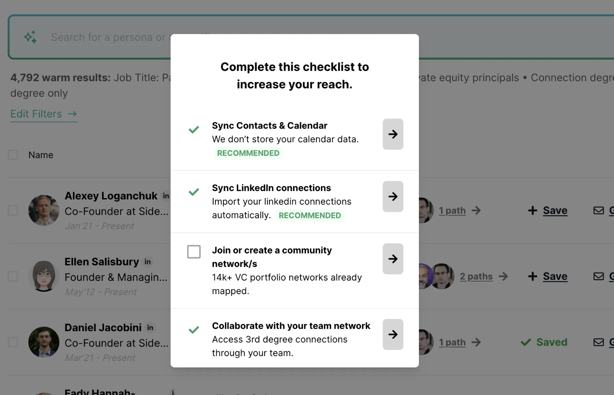

It’s most useful if you would like to offer your users a way to setup/sync their network from their account settings page.

<Info>
  The "Find intro" button automatically triggers the sync network experience when no paths are found.
</Info>

<Accordion title="Example" defaultOpen={true}>
  
</Accordion>

<Steps>
  <Step title="Pre-requisites" titleSize="h2">
    **Initiate the JS SDK**

    Copy the snippet below and add it within the `<head>` tag The unique user identifier should be unique - such as an email, or an internal ID. This is required for you to later on be able to cancel users from being added to your upcoming bill.

    To explore the product without syncing a real account, you can use the `demo_pk_global` key. This reduces onboarding friction and allows you to evaluate key features faster. When ready for production, replace it with your real `VILLAGE_PUBLIC_KEY`.

    ```javascript
    <script>
     (function(){var w=window;var d=document;var v=w.Village||{};d.head.appendChild(Object.assign(d.createElement("style"),{textContent:'[village-paths-availability="found"],[village-paths-availability="not-found"]{display:none}'}));v.q=v.q||[];v._call=function(method,args){v.q.push([method,args])};v.init=function(){v._call("init",arguments)};v.identify=function(){v._call("identify",arguments)};w.Village=v;var l=function(){var s=d.createElement("script");s.type="text/javascript";s.async=true;s.src="https://js.village.do";var x=d.getElementsByTagName("script")[0];x.parentNode.insertBefore(s,x)};if(w.Village.loaded)return;if(w.attachEvent){w.attachEvent("onload",l)}else{w.addEventListener("load",l,false)}w.Village.loaded=true})();
    	
       // Initialize Village SDK for production usage
       Village.init('VILLAGE_PUBLIC_KEY');
       Village.identify('YOUR_UNIQUE_USER_IDENTIFIER');
       
       // To explore the product without syncing a real account, you may use the demo key:
       // Village.init('demo_pk_global');
       
       // Village.authorize('USER_TOKEN'); Coming soon
    </script>
    ```
  </Step>

  <Step title="Add sync buttom" titleSize="h2">
    **Embed the sync network module**

    Copy the snippet below and add it within the `<head>` tag The unique user identifier should be unique - such as an email, or an internal ID. This is required for you to later on be able to cancel users from being added to your upcoming bill.

    ```markup
    <button village-module="sync">Sync network</button>
    ```
  </Step>
</Steps>