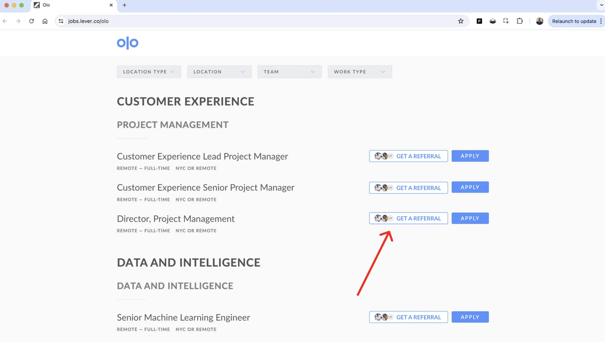
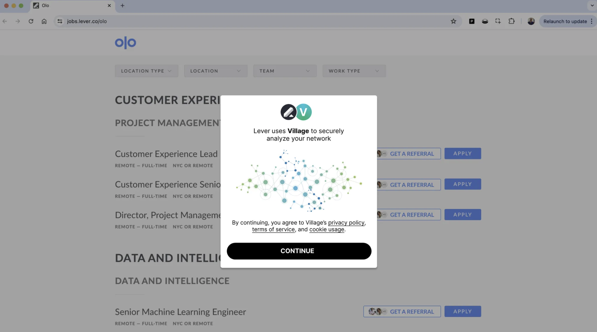

##

# Here's how it works&#x20;

<Steps>
  <Step title="You integrate Village ― in as simple as one line-of-code" titleSize="h3">
    
  </Step>

  <Step title="Your user authorizes Village to sync their network" titleSize="h3">
    
  </Step>

  <Step title="User syncs their network in a few easy steps" titleSize="h3">
    
  </Step>

  <Step title="Surface relevant 1st, 2nd or 3rd degree team relationships to help your users be more successful" titleSize="h3">
    
  </Step>
</Steps>

## Key benefits

<Icon icon="check" color="green" /> **Integrate in just 1 week**, compared to 1.5 years building in-house. 
<Icon icon="check" color="green" /> **Save $1.5M+ costs**: from engineering, data to server expenses. 
<Icon icon="check" color="green" /> Make your user base your **competitive network moat** 
<Icon icon="check" color="green" /> Fully managed **data acquisition, cleaning, and reliability**. 
<Icon icon="check" color="green" /> Supports **10+ data sources** for unmatched relationship intelligence. 
<Icon icon="check" color="green" /> Access the fastest growing **global relationship grid** with 30+ partners. 
<Icon icon="check" color="green" /> **Utilize Meta/LinkedIn scale social graph features** with simple REST APIs. 

## Common Use-cases

The first step to world-class documentation is setting up your editing environments.

<CardGroup cols={2}>
  <Card title="ATS" icon="list-check" href="use-cases/ats" />

  <Card title="Job search" icon="briefcase" href="use-cases/job-search" />

  <Card title="Fundraising" icon="sack-dollar" href="use-cases/fundraising" />

  <Card title="Lead intelligence" icon="arrows-down-to-people" href="use-cases/lead-intelligence" />

  <Card title="Sales prospecting" icon="headset" href="use-cases/sales-prospecting" />

  <Card title="Talent sourcing" icon="brain" href="use-cases/talent-sourcing" />
</CardGroup>

## Getting started

Update your docs to your brand and add valuable content for the best user conversion.

<CardGroup cols={2}>
  <Card title="⚡ Go live in 1 day" icon="palette" href="/quickstart" />

  <Card title="Reference APIs" icon="code" href="/api-reference/introduction" />
</CardGroup>