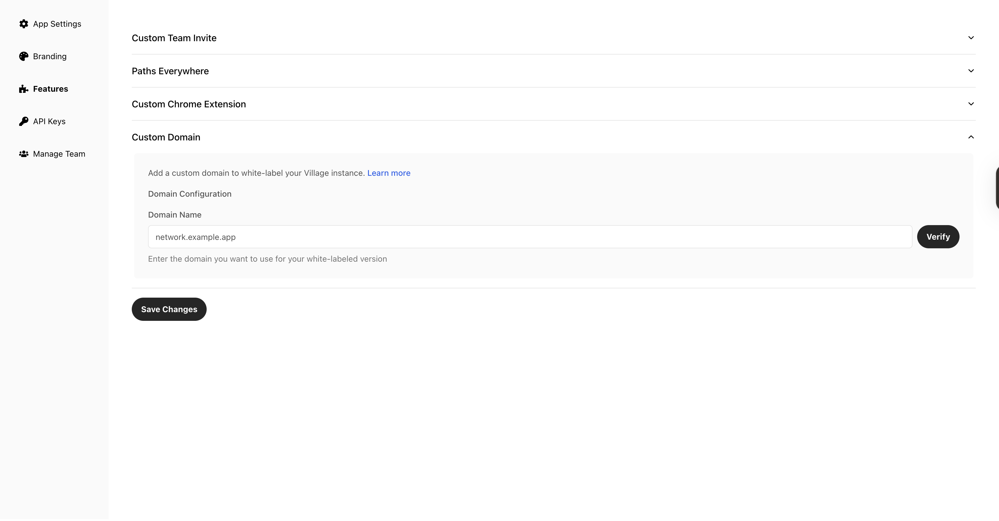

<Steps>
  <Step title="🔗 Go to Platform → Settings → Features → Custom domain">
    Navigate to the [Features](https://village.do/platform/settings/features) section of your platform settings and select **Custom domain** to start the white-label setup.

    
  </Step>
  <Step title="✅ Verify your domain">
    Follow the on-screen instructions to add the required DNS record and confirm ownership of your domain.
  </Step>
  <Step title="🎨 Further customize your branding">
    In **App settings**, provide an Image URL to brand the experience on your white-label domain.
  </Step>
</Steps>